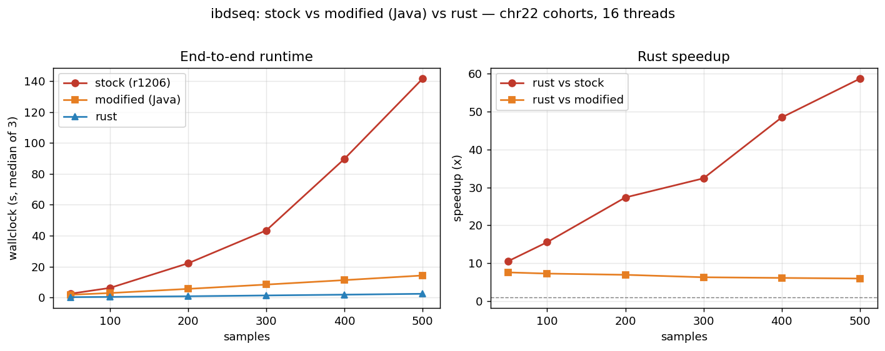

# ibdseq benchmark: stock vs modified (Java) vs rust

End-to-end wallclock comparison of three implementations on random sample cohorts
drawn from chr22 of the `ho_20210824_impute_ancient_251004_impute_info_08` dataset.

- **stock** — original `ibdseq.r1206.jar`
- **modified** — the optimized Java build in the companion `ibdseq_mod` repo
  (dose-byte layout, folded score cells, block threading; bit-identical to stock)
- **rust** — this port (sparse exclusion-marker kernel + parallel output)

## Method

`run_benchmark.sh` builds cohorts of 50/100/200/300/400/500 samples
(`bcftools view -c1:nonmajor -S <first N samples>`), then runs each implementation
3× per size and records the **median total wallclock** (process start to exit, via
`date`). Identical parameters and 16 threads for all three:

```
minalleles=2 ibdlod=3 ibdtrim=0 errormax=0.001 errorprop=0.25
r2window=500 r2max=0.15 nthreads=16
```

Reproduce: `bash run_benchmark.sh && python3 plot.py`.

## Results (`results.tsv`)

| samples | stock (s) | modified (s) | rust (s) | rust vs stock |
|--------:|----------:|-------------:|---------:|--------------:|
|      50 |      2.52 |         1.81 |     0.24 |        10.5×  |
|     100 |      6.21 |         2.89 |     0.40 |        15.5×  |
|     200 |     22.14 |         5.59 |     0.81 |        27.3×  |
|     300 |     43.40 |         8.38 |     1.34 |        32.4×  |
|     400 |     89.65 |        11.25 |     1.85 |        48.5×  |
|     500 |    141.45 |        14.25 |     2.41 |        58.7×  |



## Notes

- At these sizes detection is cheap, so total time also includes VCF read, LD
  pruning, and (for Java) JVM startup. Stock's runtime climbs steeply because its
  per-pair `score()` kernel dominates as pairs grow (~N²); the modified Java build
  flattens this and rust flattens it further while also avoiding JVM startup.
- Rust stays ~6× faster than the modified Java build across the range and pulls
  further ahead of stock as N grows (10× → 59×).
- For the large-scale picture, the full chr22 run (19,949 samples) takes ~5.1 min
  in rust (detection 242 s) vs ~58 min for the equivalent dense path — see the top
  level repo README / commit history. All three implementations produce concordant
  segments (validated separately; the timings here are runtime only).
